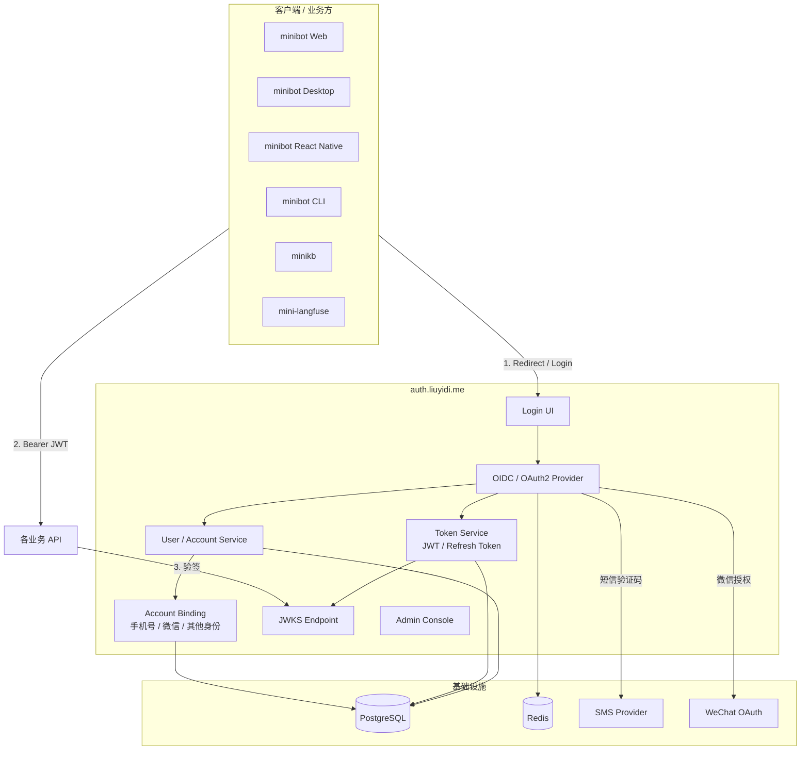

# `auth.liuyidi.me` 第一版设计文档

> 目标：把当前这个后端演进成一个可复用的统一身份中心，供 `minibot`、`minikb`、`mini-langfuse` 等业务系统统一接入。

## 1. 背景

当前项目已经具备最基础的用户注册、登录、JWT 刷新和登出能力，但它仍然更像一个单体业务后端，而不是一个可对外复用的统一认证中心。

下一阶段的目标不是继续强化某一个业务接口，而是把它抽象成一个独立的身份平台：

- 对外域名：`auth.liuyidi.me`
- 服务定位：统一登录、统一身份、统一 token 签发
- 接入对象：其他业务系统、Web、Desktop、RN、CLI

这意味着它需要同时满足以下诉求：

- 手机号登录
- 短信验证码登录 / 注册
- 微信登录 / 绑定 / 注册
- 统一发放 JWT
- 业务系统通过标准协议接入
- 后续可以继续扩展邮箱、密码、Passkey、MFA 等能力

## 2. 设计目标

### 2.1 产品目标

- 让多个业务共享同一个账号体系
- 让登录能力集中在一个地方维护
- 降低每个业务重复实现登录、短信、微信回调、token 管理的成本
- 让移动端、Web、桌面端、CLI 的认证体验尽量统一

### 2.2 技术目标

- 协议优先：使用标准 OIDC / OAuth 2.0 接入
- Token 标准化：使用 JWT 作为访问令牌
- 状态分层：短期状态放 Redis，持久化状态放 PostgreSQL
- Provider 可扩展：短信、微信都预留 provider 抽象
- 安全可控：PKCE、一次性 code、refresh token 轮换、限流、审计

## 3. 术语约定

为了避免“OAuth、OIDC、SSO、JWT”混在一起，这里先统一一下定义：

- **OAuth 2.0**：授权协议，描述应用如何获取访问权限
- **OIDC**：建立在 OAuth 2.0 上的登录协议，适合做统一身份认证
- **SSO**：单点登录效果，不是协议本身
- **JWT**：令牌格式，不是登录协议
- **IdP**：Identity Provider，统一身份提供方
- **Authorization Server**：负责发放授权码、访问令牌、刷新令牌的服务

对于 `auth.liuyidi.me`，推荐的准确定位是：

- **OIDC Identity Provider**
- **OAuth 2.0 Authorization Server**
- **SSO Center**
- **JWT Issuer**

## 4. 第一版技术选型

### 4.1 固定方案

- **Auth 服务**：独立后端服务，域名 `auth.liuyidi.me`
- **协议**：OIDC Authorization Code + PKCE
- **主 token**：JWT `access_token`
- **状态存储**：PostgreSQL
- **验证码 / 短期状态**：Redis
- **短信**：先接一家短信供应商，后续做 provider 抽象
- **微信**：先接微信开放平台 OAuth，后续补公众号 / 小程序

### 4.2 为什么是这个组合

- OIDC 能让各业务系统用标准方式接入
- Authorization Code + PKCE 适合 Web、桌面、移动端和 CLI
- JWT 适合做跨服务鉴权
- PostgreSQL 适合长期存储用户、绑定关系、会话、审计
- Redis 适合存验证码、授权码、state、nonce、限流计数器
- Provider 抽象可以避免后面换短信厂商或增加微信以外的第三方登录时大改

## 5. 总体架构

## 6. 服务拆分建议

第一版建议先按下面几个逻辑模块拆：

### 6.1 Login UI

职责：

- 提供统一登录页
- 支持手机号验证码登录
- 支持微信登录
- 支持登录态回跳

形式：

- Web 页面
- 后续可作为桌面端 / 移动端的统一登录入口

### 6.2 OIDC / OAuth2 Provider

职责：

- 生成 authorization code
- 校验 PKCE
- 生成 access token / refresh token / id token
- 暴露 OIDC discovery、JWKS、userinfo 等标准接口

### 6.3 Token Service

职责：

- 签发 JWT access token
- 签发 refresh token
- 处理 token 轮换、失效、撤销
- 管理 token claims

### 6.4 User / Account Service

职责：

- 用户注册和登录
- 用户资料管理
- 账号绑定
- 手机号唯一性约束
- 微信 openid / unionid 绑定

### 6.5 SMS Provider

职责：

- 发送短信验证码
- 后续可替换不同供应商
- 统一封装重试、限流、错误码

### 6.6 WeChat Provider

职责：

- 微信开放平台 OAuth
- 获取微信身份信息
- 绑定微信账号到本地用户

### 6.7 Session / Rate Limit / Short-lived State

职责：

- 保存验证码
- 保存授权码
- 保存 state / nonce / PKCE verifier
- 保存限流计数
- 保存短期登录上下文

## 7. 登录方式设计

### 7.1 主流程：OIDC Authorization Code + PKCE

这是所有客户端统一使用的主协议。

适用对象：

- Web
- Desktop
- React Native
- CLI

流程：

1. 客户端跳转到 `auth.liuyidi.me/authorize`
2. 用户选择手机号短信或微信登录
3. Auth 服务完成身份校验
4. Auth 服务返回 `authorization code`
5. 客户端使用 `code + code_verifier` 换取 token
6. 客户端拿到 `access_token`，后续请求业务 API 时携带 `Bearer` token

### 7.2 手机号 + 短信验证码

适用：

- 首次注册
- 登录
- 找回 / 验证手机号

建议流程：

1. 输入手机号
2. Auth 服务生成验证码并写入 Redis
3. 调用短信 provider 发短信
4. 用户输入验证码
5. 校验成功后创建或登录用户
6. 绑定手机号到本地账户

### 7.3 微信登录

适用：

- 微信内 / 微信外登录
- 已有微信身份的用户快速登录

建议流程：

1. 客户端点击“微信登录”
2. Auth 服务跳转微信 OAuth
3. 微信回调到 Auth 服务
4. Auth 服务获取微信身份信息
5. 如果已有绑定用户，直接登录
6. 如果没有绑定用户，创建新用户或引导绑定手机号

## 8. Token 设计

### 8.1 Token 类型

第一版建议至少支持：

- `access_token`
- `refresh_token`
- `id_token`，如果采用 OIDC 标准返回

### 8.2 Access Token

建议：

- 格式：JWT
- 有效期：短一些，比如 15 分钟到 1 小时
- 用途：业务 API 鉴权

### 8.3 Refresh Token

建议：

- 有效期：长一些，比如 7 天到 30 天
- 用途：静默续期
- 策略：轮换刷新，旧 refresh token 立即失效

### 8.4 推荐 Claims

JWT 中建议至少包含：

- `sub`：用户唯一 ID
- `iss`：`https://auth.liuyidi.me`
- `aud`：客户端或业务系统标识
- `exp`：过期时间
- `iat`：签发时间
- `sid`：会话 ID
- `phone`：可选
- `wechat_openid`：可选
- `tenant` 或 `org`：如果未来做多租户
- `scope`：授权范围

### 8.5 验签方式

业务服务只需要：

- 从 `/.well-known/jwks.json` 获取公钥
- 本地验 JWT 签名和过期时间
- 必要时校验 `iss`、`aud`、`scope`

## 9. 数据存储设计

### 9.1 PostgreSQL

PostgreSQL 负责所有持久化数据：

- 用户
- 账号绑定
- 业务客户端
- 会话
- refresh token
- 审计日志
- provider 配置

### 9.2 Redis

Redis 负责短期态：

- 短信验证码
- 登录 state
- PKCE verifier
- authorization code
- 限流计数
- 临时风控标记

## 10. 核心数据表建议

### 10.1 `users`

用户主表。

建议字段：

- `id`
- `display_name`
- `avatar_url`
- `status`
- `created_at`
- `updated_at`

### 10.2 `user_identities`

外部身份绑定表。

建议字段：

- `id`
- `user_id`
- `provider`：`phone` / `wechat`
- `provider_subject`：手机号、openid、unionid 等
- `provider_union_id`
- `created_at`
- `updated_at`

### 10.3 `auth_clients`

接入的业务客户端。

建议字段：

- `client_id`
- `client_secret_hash`
- `redirect_uris`
- `allowed_scopes`
- `pkce_required`
- `status`

### 10.4 `auth_sessions`

登录会话表。

建议字段：

- `id`
- `user_id`
- `client_id`
- `created_at`
- `expires_at`
- `revoked_at`
- `last_seen_at`

### 10.5 `refresh_tokens`

刷新令牌表。

建议字段：

- `id`
- `session_id`
- `token_hash`
- `rotated_from`
- `expires_at`
- `revoked_at`

### 10.6 `audit_logs`

审计日志表。

建议字段：

- `id`
- `actor_user_id`
- `action`
- `target_type`
- `target_id`
- `ip`
- `user_agent`
- `created_at`

### 10.7 `sms_codes` / `auth_codes`

短期态一般建议放 Redis，但如果你想要更强审计，也可以把关键事件落一份数据库事件表。

## 11. 标准协议接口建议

第一版建议至少提供这些标准能力：

### OIDC 标准接口

- `GET /.well-known/openid-configuration`
- `GET /oauth/authorize`
- `POST /oauth/token`
- `GET /oauth/userinfo`
- `GET /oauth/jwks.json`

### 业务管理接口

- `POST /api/v1/auth/phone/start`
- `POST /api/v1/auth/phone/verify`
- `GET /api/v1/auth/wechat/start`
- `GET /api/v1/auth/wechat/callback`
- `POST /api/v1/auth/logout`
- `POST /api/v1/auth/refresh`
- `GET /api/v1/me`

### 管理接口

- `GET /api/v1/admin/users`
- `GET /api/v1/admin/sessions`
- `GET /api/v1/admin/audit-logs`
- `POST /api/v1/admin/providers/sms`
- `POST /api/v1/admin/providers/wechat`

## 12. 客户端接入方式

### 12.1 Web

- 使用 OIDC redirect flow
- 登录后回跳到业务站点
- 前端通过 access token 调用业务 API

### 12.2 Desktop

- 推荐使用系统浏览器 + deep link
- 登录后回跳到桌面端自定义协议或本地回调地址

### 12.3 React Native

- 推荐使用系统浏览器或内嵌外部浏览器页
- 用 PKCE 避免在移动端暴露 client secret

### 12.4 CLI

- 使用 device-like 交互或本地回调页
- 也可以先支持“复制授权码”模式

## 13. 安全设计

### 13.1 必做项

- Authorization Code + PKCE
- 所有敏感 token 只返回一次
- refresh token 轮换
- 短信验证码限频
- 登录失败次数限制
- IP / 设备 / 手机号维度风控
- 重要操作审计
- JWT 签名使用非对称密钥

### 13.2 推荐项

- MFA
- account linking
- 风险设备识别
- 会话管理
- 登录提醒
- 异常地点 / 异常设备提示

## 14. 部署建议

### 14.1 组件部署

- `auth.liuyidi.me`：Auth 服务
- PostgreSQL：主数据库
- Redis：缓存与短期态
- SMS Provider：外部服务
- WeChat Open Platform：外部服务

### 14.2 域名建议

- `auth.liuyidi.me`：统一认证中心
- `bot.liuyidi.me`：minibot
- `kb.liuyidi.me`：minikb
- `mlf.liuyidi.me`：mini-langfuse

### 14.3 反向代理建议

- 所有 auth 路由走 HTTPS
- OIDC 回调地址必须严格白名单
- JWKS、discovery 等公共接口可以缓存，但建议保留较短缓存时间

## 15. 第一版 MVP 范围

建议第一版只做以下能力：

- 统一登录页
- 手机号 + 短信验证码登录 / 注册
- 微信登录 / 绑定
- OIDC Authorization Code + PKCE
- JWT access token + refresh token
- JWKS 发布
- 业务客户端注册
- 简单审计日志

先不做或延后做：

- Passkey
- 邮箱登录
- 复杂 MFA
- 企业 SSO
- 多租户控制台
- 高级权限模型

## 16. 迭代路线

### Phase 1

- 搭建独立 `auth.liuyidi.me`
- 跑通手机号短信登录
- 跑通 JWT 签发
- 跑通至少一个业务系统接入

### Phase 2

- 接入微信登录
- 接入 refresh token 轮换
- 接入 JWKS 验签
- 增加 account binding

### Phase 3

- 增加管理后台
- 增加审计日志
- 增加登录风控
- 增加多业务 client 管理

### Phase 4

- 扩展邮箱、Passkey、MFA
- 扩展公众号 / 小程序 / 更多外部 provider
- 做成完整的身份平台

## 17. 和当前 `deepseek-chat-api` 的关系

这个仓库现在已经具备“注册 / 登录 / JWT 刷新 / 登出”的基础能力，但在新方案里，它更适合作为：

- `auth.liuyidi.me` 的第一版实现基础
- 后续统一身份中心的核心服务仓库

也就是说，当前项目不需要推倒重来，而是顺着现有实现继续演进到：

- 标准 OIDC 接口
- 标准 token 体系
- 外部业务复用

## 18. 下一步建议

如果你准备继续往下做，推荐按下面顺序推进：

1. 先把数据库表和 token 设计定稿
2. 再把 OIDC discovery / authorize / token / jwks 接口补出来
3. 接着做手机号短信登录
4. 然后接微信登录
5. 最后让 `minibot` 先接入一版

